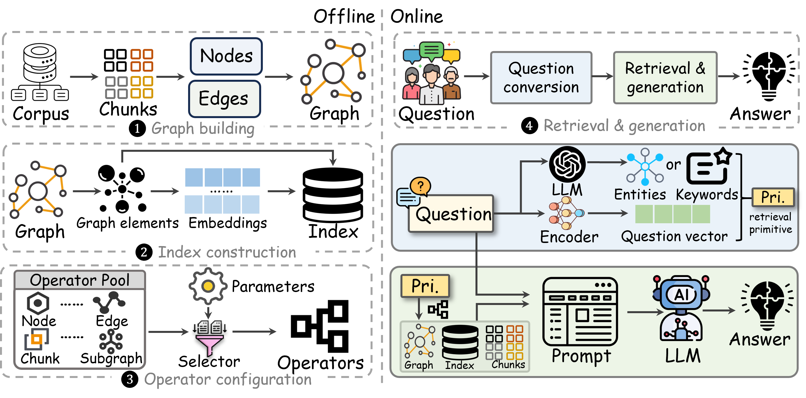

# Graph-Based RAG for Text-to-SQL Generation

## 👾 Overview

This project implements a **Graph-Based Retrieval-Augmented Generation (RAG) system** for Text-to-SQL generation using the Spider dataset. It provides comprehensive evaluation frameworks for both SQL generation and NoSQL translation.

> **GraphRAG** is a popular 🔥🔥🔥 and powerful 💪💪💪 RAG system! 🚀💡 Inspired by systems like Microsoft's, graph-based RAG is unlocking endless possibilities in AI.

> Our project focuses on **modularizing and decoupling** these methods 🧩 to **unveil the mystery** 🕵️‍♂️🔍✨ behind them and share fun and valuable insights! 🤩💫



---

## 📚 Table of Contents
- [Setup](#setup)
- [Quick Start Examples](#quick-start-examples)
- [Accuracy Evaluation](#accuracy-evaluation)
- [Graph RAG Methods](#graph-rag-methods)
- [Results](#results)
- [Architecture](#architecture)

---

## Setup

### Clone the Repository

```bash
git clone https://github.com/utkarshSinha1910/graphRagTxtToSql.git
cd graphRagTxtToSql
```

### Install Python 3.9

Install Python 3.9.6 using `pyenv` (recommended):

```bash
brew install pyenv
pyenv install 3.9.6
pyenv global 3.9.6
```

Or install via Homebrew:

```bash
brew install python@3.9
```

### Install Dependencies

```bash
pip install --upgrade pip
pip install -r requirements.txt
```

### Install Ollama

```bash
brew install ollama
```

### Verify Installation

```bash
python3 --version   # should show 3.9.6
ollama --version    # recommended: 0.12.11
```

**Notes:**
- Ollama is a native CLI tool. See [ollama.com](https://ollama.com) for docs
- Alternatively, use OpenAI by setting `OPENAI_API_KEY` and using `Core/LLM/OpenAIClient.py`

### Pull Required Models

```bash
ollama pull phi3                  # For SQL generation
ollama pull phi3-finetuned        # Fine-tuned model
ollama pull qwen2.5-coder:3b      # For NoSQL translation
```

---

## Quick Start Examples

### 1. Run Main Text-to-SQL Application

```bash
# Start Ollama server (in separate terminal)
ollama serve

# Run text-to-SQL with different graph methods
python3 main.py --task text2sql --spider_root Data/Spider --split dev --method gr
python3 main.py --task text2sql --spider_root Data/Spider --split dev --method dalk
python3 main.py --task text2sql --spider_root Data/Spider --split dev --method raptor
```

### 2. Launch Streamlit Web UI

```bash
streamlit run ui.py
```

### 3. Evaluate SQL Accuracy

```bash
# Quick evaluation (20 examples with cache)
python3 quick_sql_eval.py --max-examples 20

# Full evaluation (50 examples)
python3 quick_sql_eval.py --max-examples 50

# Show detailed results
python3 quick_sql_eval.py --max-examples 20 --show-details

# Test with sample queries
python3 test_sql_accuracy_matrix.py
```

### 4. Validate NoSQL Translations

```bash
# Semantic validation (50 examples)
python3 validate_nosql_semantic.py --max-examples 50

# Detailed validation results
python3 validate_nosql_semantic.py --max-examples 50 --show-details

# Regenerate without cache
python3 validate_nosql_semantic.py --max-examples 50 --no-cache
```

---

## Accuracy Evaluation

### Overview

Comprehensive evaluation framework for:
1. **SQL Accuracy** - Text-to-SQL generation on Spider dataset
2. **NoSQL Accuracy** - SQL-to-NoSQL semantic validation

### Files

**SQL Accuracy Evaluation:**
- `sql_accuracy_matrix.py` - Core SQL accuracy matrix class
- `quick_sql_eval.py` - SQL evaluation with caching on Spider dataset
- `test_sql_accuracy_matrix.py` - Test suite with sample queries

**NoSQL Semantic Validation:**
- `nosql_semantic_validator.py` - Logic-based semantic validation
- `validate_nosql_semantic.py` - NoSQL validation runner on noSQL2SQL dataset

### Accuracy Levels

Both evaluation systems use 5-level classification:
1. **EXACT_MATCH** - Identical after normalization
2. **SEMANTICALLY_EQUIVALENT** - 95%+ similarity, functionally same
3. **MINOR_DIFFERENCES** - 70-95% similarity, small issues
4. **MAJOR_DIFFERENCES** - 40-70% similarity, significant changes
5. **INCORRECT** - <40% similarity, wrong query

### Results (20 SQL Examples)

**SQL Generation Accuracy:**
- Strict Accuracy: **20.0%** (4/20 exact matches)
- Acceptable Accuracy: **35.0%** (7/20 exact + semantic)
- Average Similarity: **62.0%**
- Average Component Accuracy: **84.0%**

**Component-wise Performance:**
- ✅ SELECT clause: 100%
- ✅ FROM clause: 100%
- ✅ LIMIT: 95%
- ✅ ORDER BY: 90%
- ⚠️ GROUP BY: 85%
- ⚠️ DISTINCT: 85%
- ⚠️ Aggregations: 80%
- ⚠️ WHERE conditions: 75%
- ⚠️ Table names: 70%
- ❌ JOINs: 60% (needs improvement)

### Results (50 NoSQL Examples)

**NoSQL Semantic Validation:**
- Correct Translations: **38.0%** (19/50)
- Acceptable: **80.0%** (40/50)
- Average Validation Score: **90.44%**

**Validation Criteria Pass Rates:**
- ✅ Collection names: 100%
- ✅ Sort direction: 100%
- ✅ Aggregation handling: 100%
- ✅ Sort operations: 98%
- ✅ GROUP BY handling: 98%
- ✅ Filter/WHERE conditions: 96%
- ✅ LIMIT values: 90%
- ⚠️ JOIN handling: 68%
- ⚠️ Projection/SELECT: 64%

**Note:** NoSQL validation uses semantic logic checking (not reference comparison), validating if generated NoSQL correctly implements SQL query intent.

### Output Files
- `spider_sql_cache.json` - Cached SQL query pairs
- `spider_sql_accuracy_results.json` - Detailed SQL results
- `nosql_generation_cache.json` - Cached NoSQL translations
- `nosql_validation_results.json` - NoSQL semantic validation results

### Models Used

**SQL Generation:**
- Model: `phi3-finetuned`
- Task: Natural language → SQL
- Dataset: Spider (dev split)

**NoSQL Generation:**
- Model: `qwen2.5-coder:3b`
- Task: SQL → MongoDB NoSQL
- Dataset: noSQL2SQL (9,428 query pairs)

---

## Graph RAG Methods

### Representative Methods

| Method | Description| Link | Graph Type|
| --- |--- |--- | :---: | 
| RAPTOR | ICLR 2024 | [](https://arxiv.org/abs/2401.18059)  [](https://github.com/parthsarthi03/raptor)| Tree |
| KGP | AAAI 2024 | [](https://arxiv.org/abs/2308.11730)  [](https://github.com/YuWVandy/KG-LLM-MDQA)| Passage Graph |
| DALK | EMNLP 2024 | [](https://arxiv.org/abs/2405.04819) [](https://github.com/David-Li0406/DALK)| KG |
| HippoRAG | NIPS 2024 | [](https://arxiv.org/abs/2405.14831) [](https://github.com/OSU-NLP-Group/HippoRAG) | KG |
| G-retriever | NIPS 2024  | [](https://arxiv.org/abs/2402.07630) [](https://github.com/XiaoxinHe/G-Retriever)| KG |
| ToG | ICLR 2024  | [](https://arxiv.org/abs/2307.07697) [](https://github.com/IDEA-FinAI/ToG)| KG |
| MS GraphRAG | Microsoft Project |  [](https://arxiv.org/abs/2404.16130) [](https://github.com/microsoft/graphrag)| TKG |
| FastGraphRAG | CircleMind Project  | [](https://github.com/circlemind-ai/fast-graphrag)| TKG |
| LightRAG | High Star Project  | [](https://arxiv.org/abs/2410.05779) [](https://github.com/HKUDS/LightRAG)| RKG |

### Implemented Methods

This repository implements several graph builders (see `Core/Graph/GraphBuilder.py`):

| Method | Short description | Graph Type | Key behavior |
|---|---:|:---:|---|
| `schema` | Schema-only graph (table → column) | Schema graph | Adds table and column nodes; table→column edges |
| `dalk` | Token-overlap + schema edges | KG / Passage | Adds schema edges and undirected semantic edges by token-overlap |
| `gr` | Graph-based retrieval (directed semantic links) | KG / Passage | Schema edges + directed semantic edges (overlap threshold) |
| `lgraphrag` | Local-search (top-K neighbors) | KG / Passage | Keeps top-k neighbors per node by overlap + schema edges |
| `ggraphrag` | Global-search (global similarity links) | KG / Passage | Connects globally similar nodes above threshold (bidirectional) |
| `hipporag` | PK-focused + intra-table links | KG | Emphasizes primary-key relationships and light semantic links |
| `kgp` | Co-occurrence / table-mention propagation | Passage Graph / KG | Adds co-occurrence edges and fallback semantic links |
| `lightrag` | Lightweight: schema + strong semantic matches | RKG | Only strong overlap edges plus schema edges (conservative) |
| `raptor` | PageRank-based pruning of semantic graph | Tree-like / Pruned Graph | Builds weighted semantic graph, runs PageRank and prunes weak edges |
| `tog` | Tree-of-Graphs backbone (MST) | Chunk Tree / KG backbone | Builds MST over semantic similarities and converts to bidirectional tree |

### Graph Types

Based on entity and relation, graphs are categorized as:

- **Chunk Tree**: Tree structure formed by document content and summary
- **Passage Graph**: Relational network of passages, tables, and document elements
- **KG**: Knowledge graph with entities and relationships (triples)
- **TKG**: Textual KG with entity descriptions and type information
- **RKG**: Rich KG with keywords associated with relations

**Classification Criteria:**

|Graph Attributes | Chunk Tree |Passage Graph | KG  | TKG | RKG |
| --- |--- |--- |--- | --- | --- |
|Original Content| ✅|✅| ❌|❌|❌| 
|Entity Name| ❌|❌|✅|✅|✅|
|Entity Type| ❌| ❌| ❌|✅|✅|
|Entity Description|❌| ❌| ❌|✅|✅|
|Relation Name| ❌|❌|✅|❌|✅|
|Relation keyword|❌| ❌| ❌|❌|✅|
|Relation Description|❌| ❌| ❌|✅|✅|
|Edge Weight| ❌|❌|✅|✅|✅|

---

## Architecture

### Code Organization

```
Core/
  ├── Chunk/              # Schema chunking
  ├── Graph/              # Graph building methods
  ├── LLM/                # LLM clients (Ollama, OpenAI)
  └── Retriever/          # Schema retrieval

Data/
  └── Spider/             # Spider dataset
      ├── database/       # 200+ databases
      └── noSQL2SQL/      # 9,428 SQL-NoSQL pairs

Evaluation Files:
  ├── sql_accuracy_matrix.py           # SQL evaluation framework
  ├── quick_sql_eval.py                # SQL evaluation runner
  ├── test_sql_accuracy_matrix.py      # SQL test suite
  ├── nosql_semantic_validator.py      # NoSQL semantic validation
  └── validate_nosql_semantic.py       # NoSQL validation runner
```

### Using the Accuracy Matrix

**SQL Evaluation:**
```python
from sql_accuracy_matrix import SQLAccuracyMatrix

matrix = SQLAccuracyMatrix()
result = matrix.evaluate_query(
    generated="SELECT * FROM users WHERE age > 18",
    gold="SELECT * FROM users WHERE age > 18",
    question="Get adult users",
    db_id="user_db"
)
matrix.print_detailed_report()
matrix.export_results()
```

**NoSQL Semantic Validation:**
```python
from nosql_semantic_validator import NoSQLSemanticValidator

validator = NoSQLSemanticValidator()
result = validator.validate_translation(
    sql="SELECT * FROM users WHERE age > 18",
    nosql='{"collection": "users", "filter": {"age": {"$gt": 18}}}',
    index=1
)
validator.print_detailed_report()
validator.export_results()
```

### Caching System

Both evaluation scripts use caching for efficiency:
- Auto-saves after every 5 examples
- Loads cached results on next run
- Use `--no-cache` flag to regenerate
- Cache files in JSON format

### Data Sources

**Spider Dataset:**
- Location: `Data/Spider/`
- Files: `dev.json`, `train_spider.json`, `tables.json`
- Size: 10,181 examples (dev: ~1,000, train: ~9,000)
- Databases: 200+ databases

**noSQL2SQL Dataset:**
- Location: `Data/Spider/noSQL2SQL/`
- Size: 9,428 SQL-NoSQL query pairs
- Format: One-to-one mapping

---

## Troubleshooting

### Slow Generation
- Use cached results with `--max-examples` limit
- LLM inference: ~2-5 seconds per query
- 50 queries ≈ 2-5 minutes total

### Connection Issues
- Ensure Ollama is running: `ollama serve`
- Check models: `ollama list`
- Pull models: `ollama pull qwen2.5-coder:3b`

### Parse Errors
- NoSQL validator handles both JSON and string formats
- Failed parses still get similarity comparison
- Check `parsing_success_rate` in summary

---

## Future Plans

- [ ] Detailed readme enhancements
- [ ] Support RoG, PathRAG methods
- [ ] Docker image for easy deployment
- [ ] Additional LLM support (Azure, etc.)
- [ ] Execution-based evaluation
- [ ] Visualization dashboard
- [ ] Batch evaluation with parallel processing

---

## Citation

If you find this work useful, please cite:

```
@article{zhou2025depth,
  title={In-depth Analysis of Graph-based RAG in a Unified Framework},
  author={Zhou, Yingli and Su, Yaodong and Sun, Youran and Wang, Shu and Wang, Taotao and He, Runyuan and Zhang, Yongwei and Liang, Sicong and Liu, Xilin and Ma, Yuchi and others},
  journal={arXiv preprint arXiv:2503.04338},
  year={2025}
}
```

---

## License

See [LICENSE](LICENSE) file for details.


