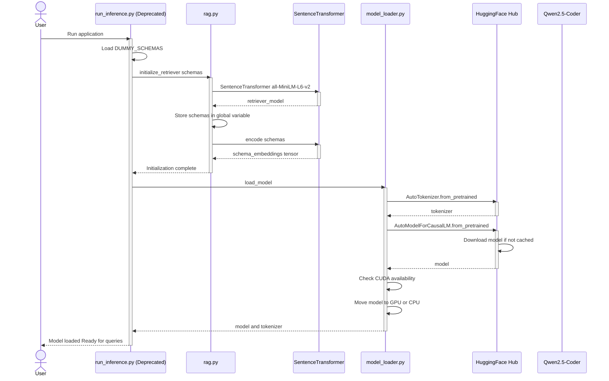
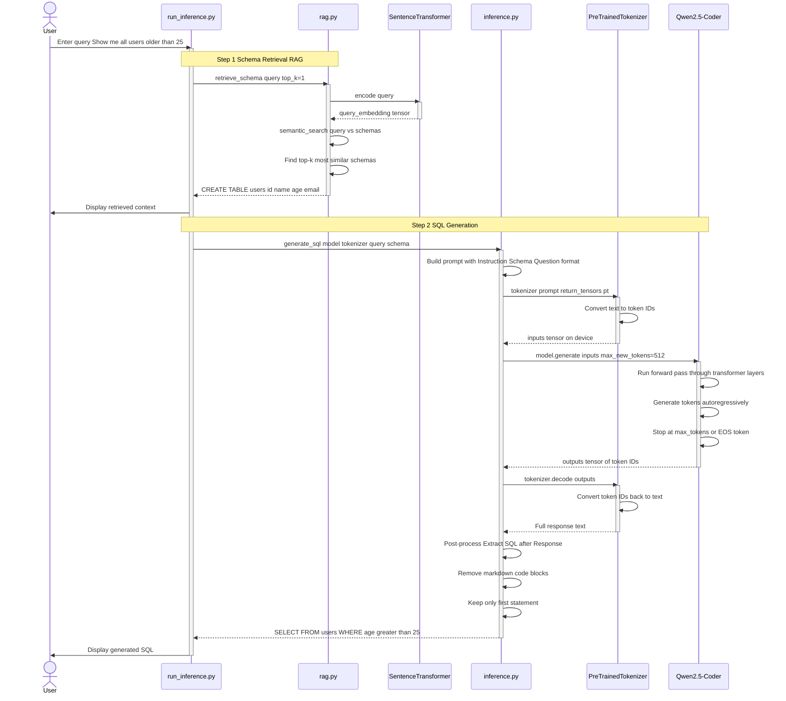
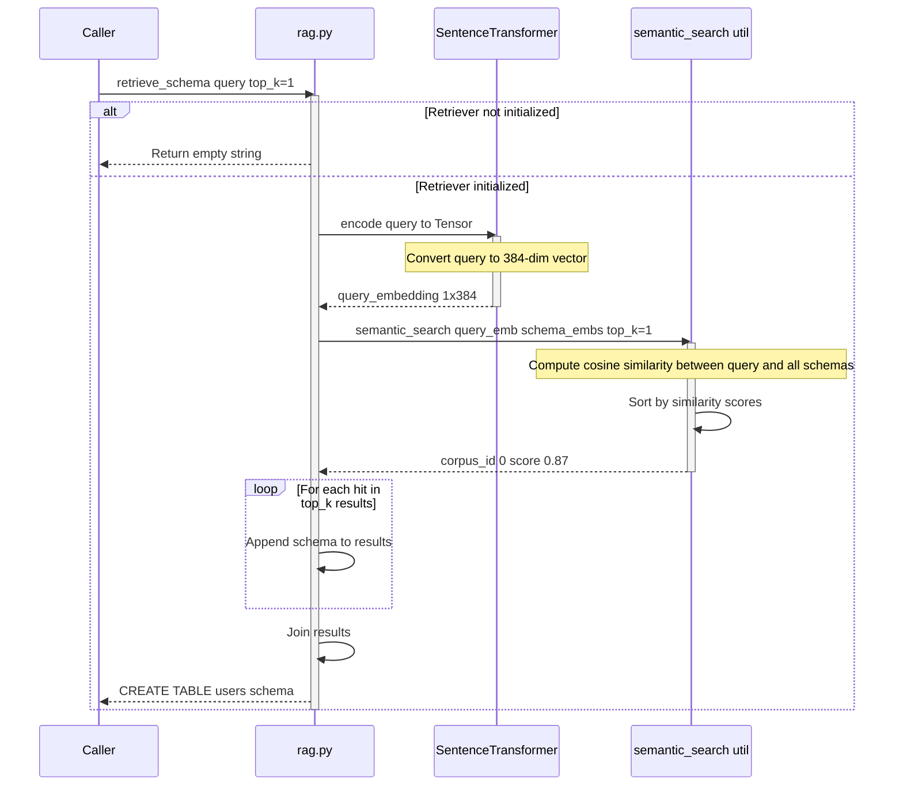
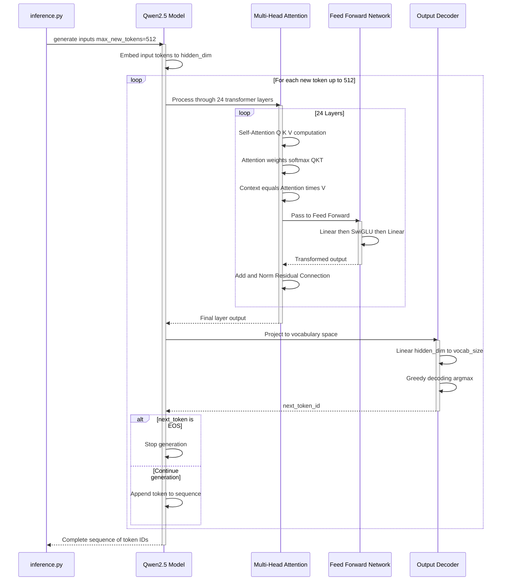
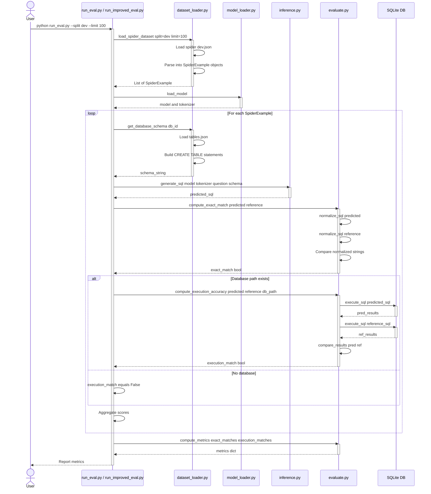
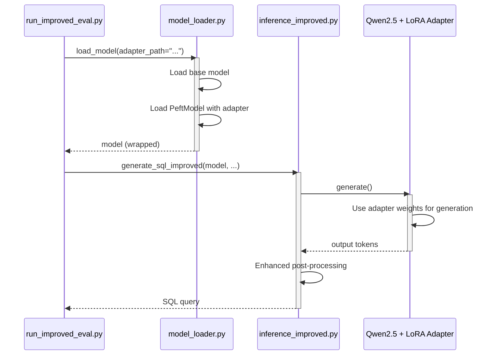
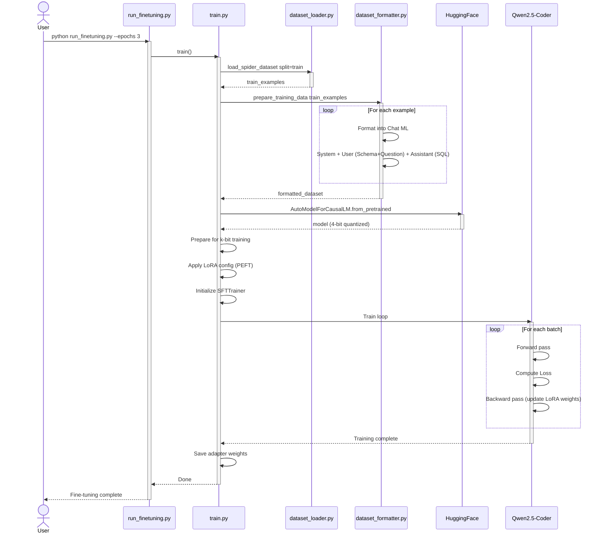
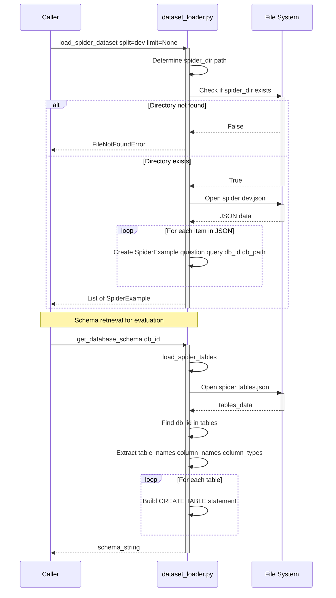
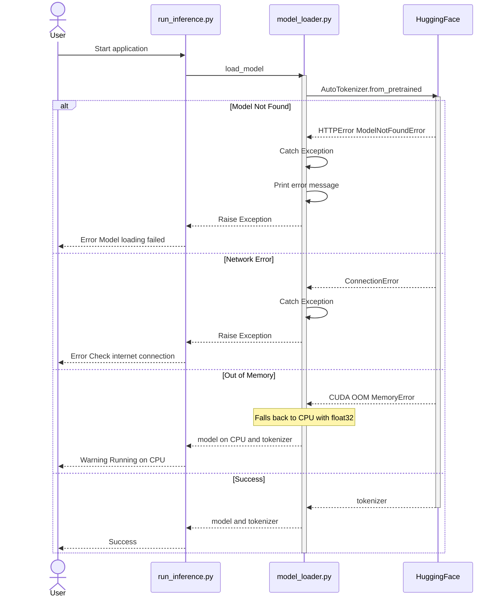
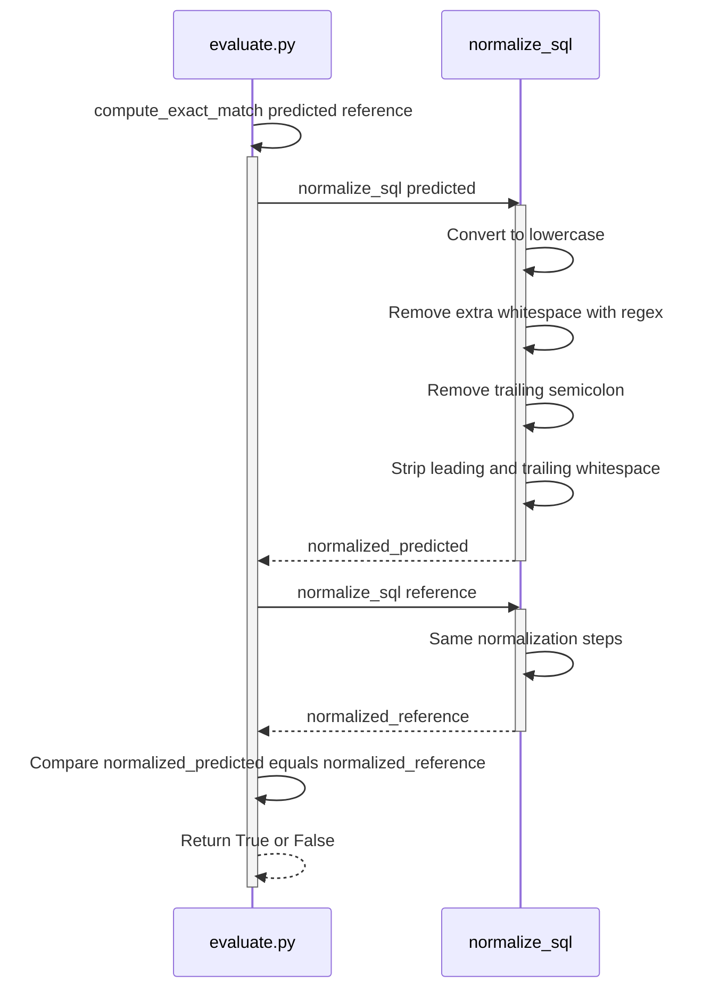

# Text-to-SQL Application - Sequence Diagrams

This document contains detailed sequence diagrams showing the flow of the Text-to-SQL application.

## 1. Application Initialization Flow

This diagram shows what happens when the application starts up.



## 2. Query Processing Flow - Main Inference

This diagram shows the complete flow when a user submits a natural language query.



## 3. RAG Retrieval Detail Flow

This diagram zooms into the semantic search mechanism used in RAG.



## 4. Model Inference Detail Flow

This diagram shows what happens inside the transformer model during generation.



## 5. Evaluation Flow

This diagram shows the complete evaluation pipeline using the Spider dataset.



## 6. Few-Shot Inference Flow

This diagram shows the enhanced few-shot prompting approach.

```mermaid
sequenceDiagram
    participant Caller as Caller
    participant FewShot as inference_fewshot.py
    participant Tokenizer as PreTrainedTokenizer
    participant Model as Qwen2.5-Coder
    
    Caller->>FewShot: generate_sql_fewshot model tokenizer query schema
    activate FewShot
    
    FewShot->>FewShot: Load FEW_SHOT_EXAMPLES 3 examples
    
    Note over FewShot: Build prompt with examples
    
    FewShot->>FewShot: Construct full prompt with examples plus target query
    
    FewShot->>Tokenizer: tokenizer prompt return_tensors pt
    activate Tokenizer
    Tokenizer-->>FewShot: inputs
    deactivate Tokenizer
    
    FewShot->>Model: model.generate max_new_tokens=256 do_sample=False
    activate Model
    Model-->>FewShot: outputs
    deactivate Model
    
    FewShot->>Tokenizer: tokenizer.decode outputs
    activate Tokenizer
    Tokenizer-->>FewShot: response_text
    deactivate Tokenizer
    
    FewShot->>FewShot: Extract SQL after last SQL marker
    FewShot->>FewShot: Remove markdown formatting
    FewShot->>FewShot: Remove explanatory text
    FewShot->>FewShot: Keep first statement only
    
    FewShot-->>Caller: cleaned_sql
    deactivate FewShot
    FewShot-->>Caller: cleaned_sql
    deactivate FewShot
```

## 7. Improved Inference Flow (Fine-tuned)

This diagram shows the inference flow using the fine-tuned adapter.



## 7. Fine-tuning Flow

This diagram shows the process of fine-tuning the model on the Spider dataset using QLoRA.



## 8. Dataset Loading Flow

This diagram shows how the Spider dataset is loaded and processed.



## 9. Error Handling Flow

This diagram shows error scenarios and how they are handled.



## 10. SQL Normalization and Comparison Flow

This diagram shows how SQL queries are normalized for exact match comparison.



---

## Component Interaction Summary

### Key Components

1. **run_eval.py** - Entry point for baseline evaluation
2. **run_improved_eval.py** - Entry point for fine-tuned evaluation
3. **rag.py** - Retrieves relevant database schemas using semantic search
4. **model_loader.py** - Downloads and initializes the Qwen2.5-Coder-0.5B-Instruct model
5. **inference.py** - Zero-shot SQL generation logic
6. **inference_fewshot.py** - Few-shot SQL generation with example prompts
7. **dataset_loader.py** - Loads Spider dataset and database schemas
8. **evaluate.py** - Metrics computation exact match and execution accuracy

### Data Flow

```
User Query 
  → RAG Retrieval find relevant schema 
  → Prompt Construction Instruction plus Schema plus Question 
  → Tokenization text to token IDs 
  → Model Inference Qwen2.5-Coder transformer 
  → Detokenization token IDs to text 
  → Post-processing extract SQL clean formatting 
  → Generated SQL
```

### Evaluation Flow

```
Spider Dataset dev.json
  → Load Examples question reference SQL db_id
  → For each example
      → Get schema from tables.json
      → Generate SQL using model
      → Compute Exact Match string comparison
      → Compute Execution Accuracy run on SQLite compare results
  → Aggregate metrics
  → Report Exact Match percent Execution Accuracy percent
```

### Model Specifications

| Property | Value |
|----------|-------|
| Model | Qwen2.5-Coder-0.5B-Instruct |
| Parameters | 500M |
| Context Length | 32768 tokens |
| Embedding Model | all-MiniLM-L6-v2 384-dim |
| Inference | Greedy decoding do_sample=False |
