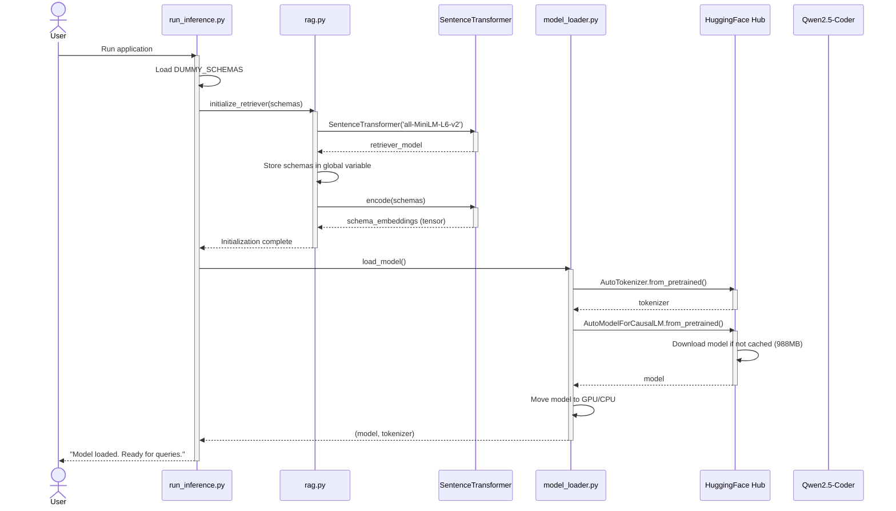
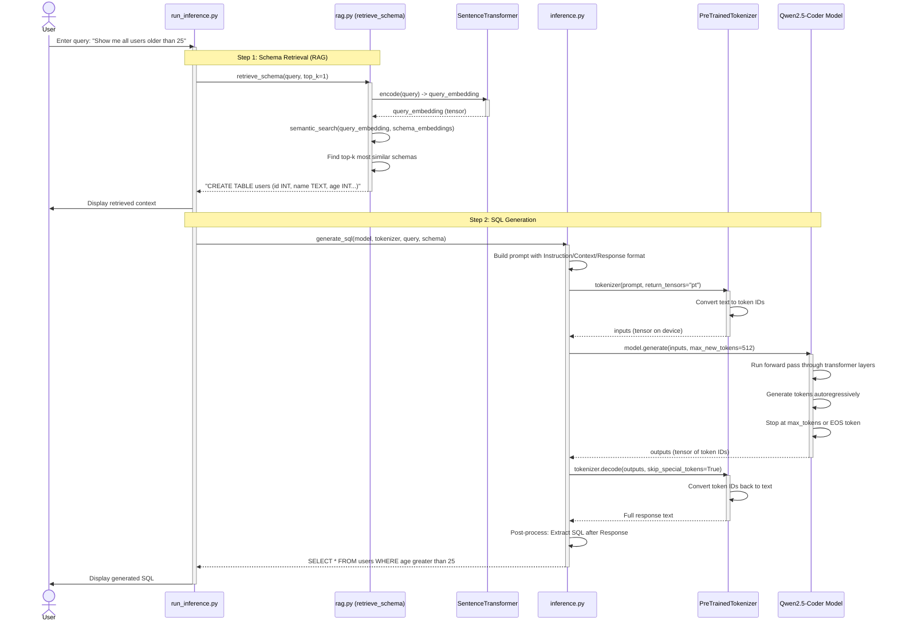
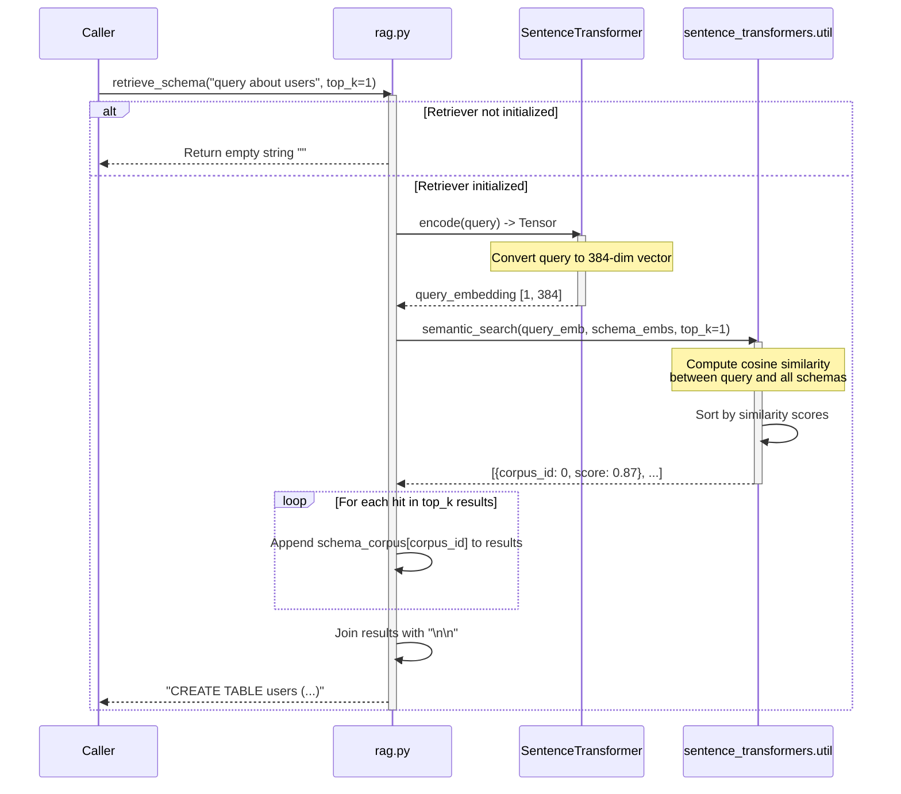
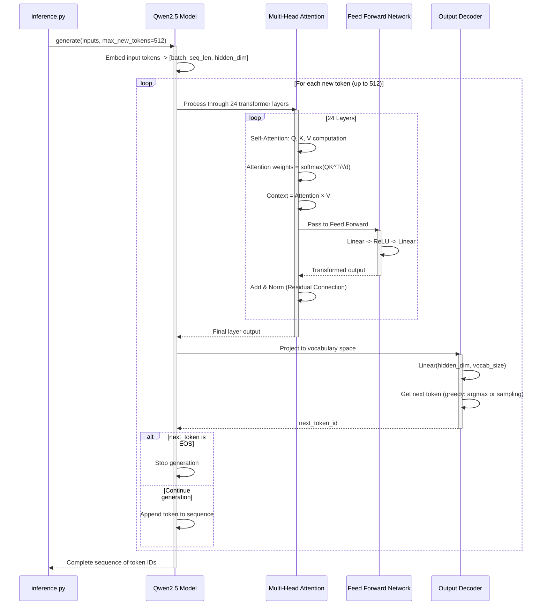
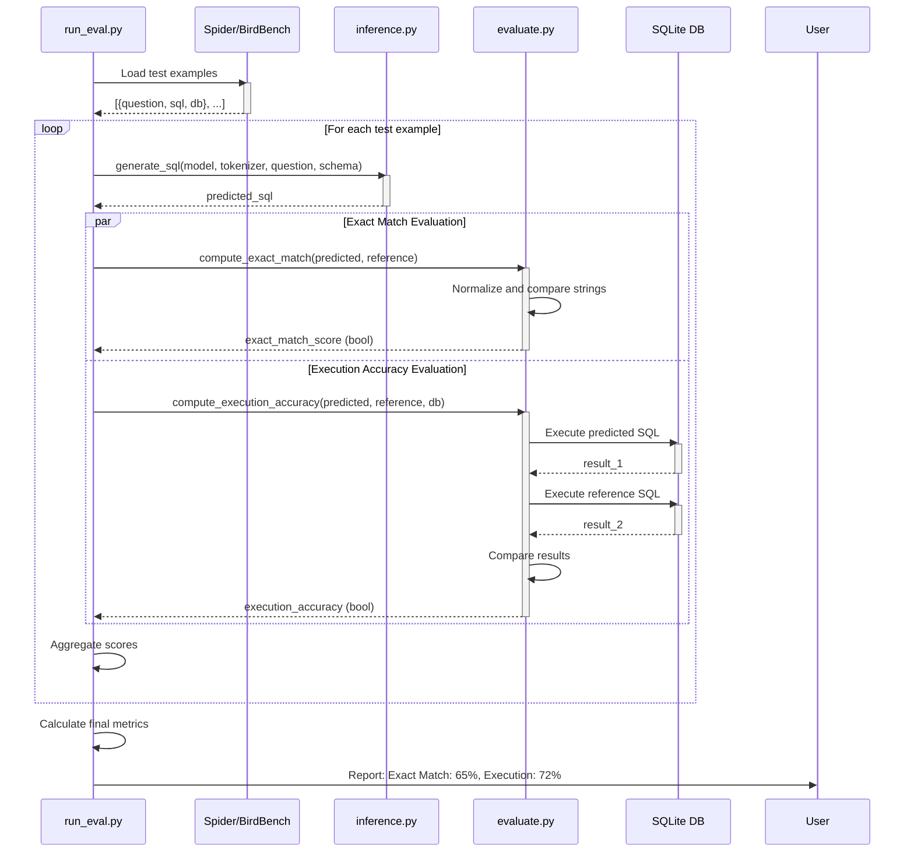
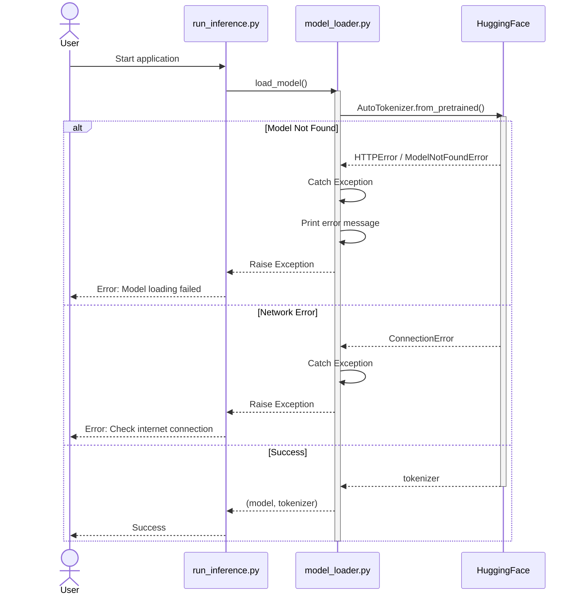

# Text-to-SQL Application - Sequence Diagrams

This document contains detailed sequence diagrams showing the flow of the Text-to-SQL application.

## 1. Application Initialization Flow

This diagram shows what happens when the application starts up.



## 2. Query Processing Flow (Main Inference)

This diagram shows the complete flow when a user submits a natural language query.



## 3. RAG Retrieval Detail Flow

This diagram zooms into the semantic search mechanism used in RAG.



## 4. Model Inference Detail Flow

This diagram shows what happens inside the transformer model during generation.



## 5. Evaluation Flow (Conceptual)

This diagram shows how evaluation would work (currently placeholder).



## 6. Error Handling Flow

This diagram shows error scenarios and how they're handled.



## Component Interaction Summary

### Key Components:
1. **run_inference.py**: Entry point, orchestrates the flow
2. **rag.py**: Retrieves relevant database schemas using semantic search
3. **model_loader.py**: Downloads and initializes the Qwen model
4. **inference.py**: Core SQL generation logic
5. **evaluate.py**: Metrics computation (exact match, execution accuracy)

### Data Flow:
```
User Query 
  → RAG Retrieval (find relevant schema) 
  → Prompt Construction (Instruction + Context) 
  → Tokenization (text → numbers) 
  → Model Inference (transformer processing) 
  → Detokenization (numbers → text) 
  → Post-processing (extract SQL) 
  → Generated SQL
```
