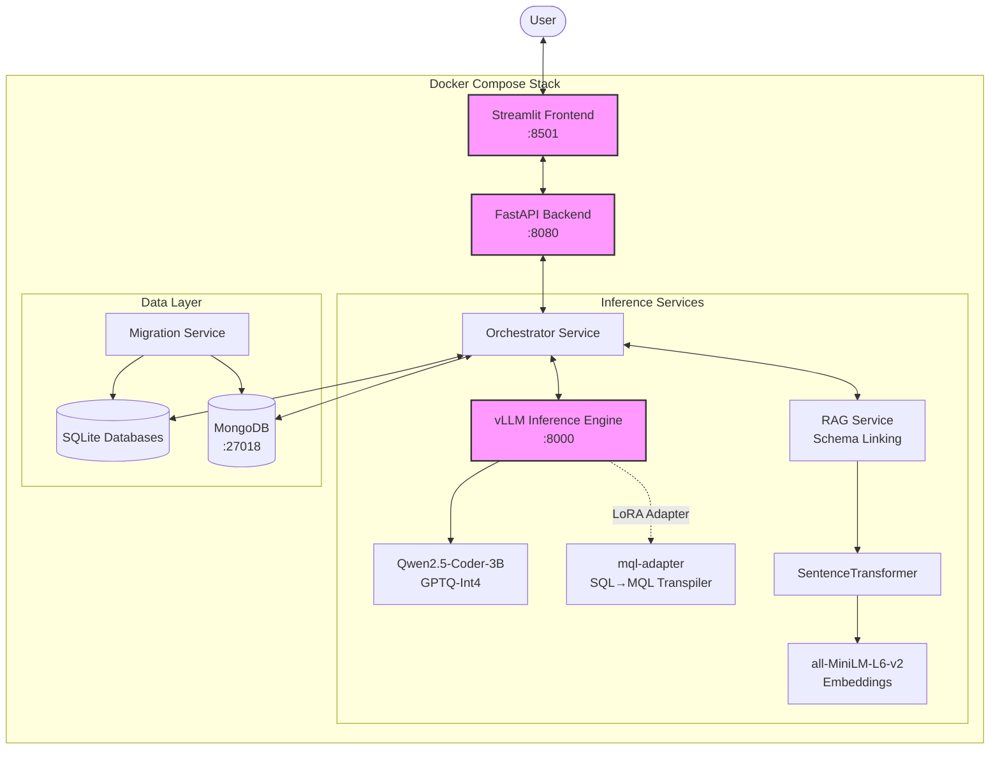

# High-Level Architecture

## System Diagram

## Component Description

### 1. Frontend (Streamlit) - Port 8501
The user interface where users:
- Select a database from 11 available BirdBench datasets (california_schools, card_games, etc.)
- Input natural language questions via chat interface
- View side-by-side comparison of SQL and NoSQL execution results
- Expand technical details to see generated SQL and MongoDB aggregation pipeline
- See execution match verification (✅ or ⚠️)

Communicates solely with the Backend API via REST (`http://backend-api:8080`).

### 2. Backend (FastAPI) - Port 8080
The central nervous system of the application. Exposes REST endpoints:
- **`GET /`**: Health check endpoint
- **`POST /api/v1/generate`**: Main query processing endpoint

The backend instantiates and manages the `Orchestrator` to coordinate the multi-step generation process.

### 3. Orchestrator
A core logic component (`backend/app/services/orchestrator.py`, 283 lines) that coordinates:
1. **Schema Discovery**: Loads SQLite database metadata and schema information
2. **Schema Linking (RAG)**: Calls RAG Service to identify top-k relevant tables using cosine similarity
3. **NL-to-SQL Generation**: Prompts the base LLM (`Qwen2.5-Coder-3B-GPTQ-Int4`) to generate SQL
4. **Reflexion Loop**: Executes SQL against SQLite and validates results
5. **SQL-to-NoSQL Transpilation**: Uses the finetuned LoRA adapter (`mql-adapter`) to convert SQL into MongoDB Aggregation Pipeline
6. **NoSQL Execution**: Executes the pipeline against MongoDB
7. **Result Comparison**: Normalizes and compares results from both databases using set-based comparison

### 4. Inference Engine (vLLM) - Port 8000
A dedicated containerized service (`inference-engine`) running the quantized model with LoRA support:
- **Base Model**: `Qwen/Qwen2.5-Coder-3B-Instruct-GPTQ-Int4` (4-bit quantized)
- **LoRA Adapter**: `mql-adapter` mounted from `./Qwen2.5-Coder-3B-Instruct-mql-adapter`
- **API**: OpenAI-compatible `/v1/chat/completions` endpoint
- **Configuration**:
  - GPU memory utilization: 85%
  - Max model length: 8192 tokens
  - Swap space: 1GB
  - Max LoRA rank: 64
  
The orchestrator calls this service twice per query:
1. Base model for SQL generation
2. LoRA adapter (`mql-adapter`) for MQL transpilation

### 5. RAG Service
Implements Retrieval-Augmented Generation for schema linking:
- **Embedding Model**: `all-MiniLM-L6-v2` from Sentence Transformers
- **Strategy**: Embeds table schemas as "Table: {name}. Columns: {col1}, {col2}..."
- **Retrieval**: Computes cosine similarity between question embedding and table embeddings
- **Top-K**: Returns 5 most relevant tables to reduce LLM context window size

### 6. Data Layer
- **SQLite**: Immutable ground-truth databases from BirdBench dataset located in `/app/data`. Used for:
  - Schema discovery and metadata extraction
  - SQL query execution and validation
  - Source data for migration

- **MongoDB (Port 27018)**: Target operational database running in container `mongo-db`:
  - External port: 27018 → Container port: 27017
  - Stores migrated data from SQLite in document format
  - Executes MongoDB aggregation pipelines
  - Indexed using foreign key relationships from SQLite schema

### 7. Migration Service
The `MigrationService` class (`services/migration/migrate.py`, 121 lines) handles:
- **Schema Discovery**: Extracts table, column, and foreign key metadata from SQLite
- **Data Transfer**: Migrates data in 50,000-record chunks to handle large tables
- **Type Conversion**: Converts SQLite types to MongoDB-compatible formats
- **Indexing**: Creates MongoDB indexes based on SQLite foreign key relationships
- **NaT Handling**: Converts datetime NaT values to None for JSON serialization
