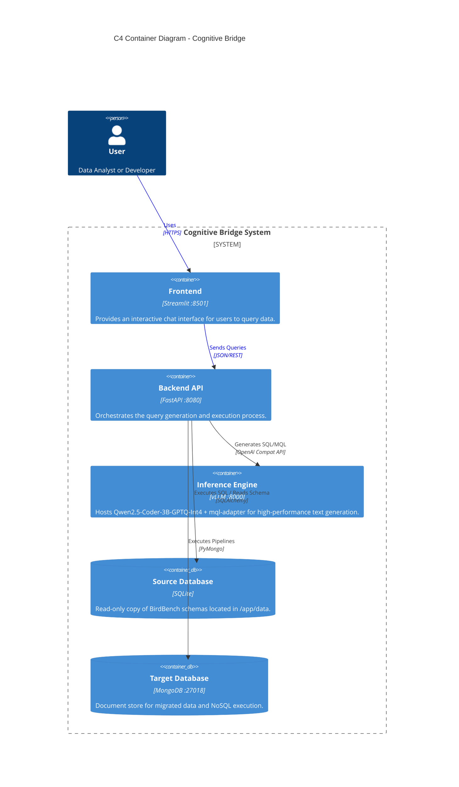
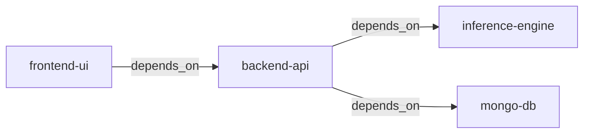

# High-Level Design (HLD)

## C4 Container Diagram

The following diagram illustrates the high-level containers and their interactions within the Cognitive Bridge system.



## Docker Deployment

### Container Overview
| Container Name | Image | External Port | Internal Port | Purpose |
|:---|:---|:---|:---|:---|
| `frontend-ui` | Custom (Streamlit) | 8501 | 8501 | Web UI |
| `backend-api` | Custom (FastAPI) | 8080 | 8080 | REST API |
| `inference-engine` | vllm/vllm-openai:latest | 8000 | 8000 | LLM Inference |
| `mongo-db` | mongo:latest | 27018 | 27017 | NoSQL Database |

### Service Dependencies


### Environment Variables

**Backend API** (`backend-api`):
```bash
MONGO_URI=mongodb://mongo-db:27017
INFERENCE_URL=http://inference-engine:8000/v1
```

**Frontend** (`frontend-ui`):
```bash
BACKEND_URL=http://backend-api:8080
```

**Inference Engine** (`inference-engine`):
```bash
HUGGING_FACE_HUB_TOKEN=${HF_TOKEN}  # Optional for private models
```

### Volume Mounts

**Inference Engine**:
- `~/.cache/huggingface:/root/.cache/huggingface` - Model cache
- `./Qwen2.5-Coder-3B-Instruct-mql-adapter:/root/adapters/mql-adapter` - LoRA adapter

**Backend API**:
- `./backend:/app` - Live code reloading
- `./data:/app/data` - BirdBench databases
- `./services:/app/services` - Shared service modules

**Frontend**:
- `./frontend:/app` - Live code reloading

**MongoDB**:
- `mongo_data:/data/db` - Persistent data volume

---

## Detailed Design

### 1. Frontend (Streamlit)
- **Role**: Presentation Layer
- **Responsibilities**:
    - Capture user input (Natural Language Question)
    - Provide database selector dropdown (11 options from BirdBench)
    - Display chat history with user and assistant messages
    - Render generated SQL query with syntax highlighting
    - Render generated MongoDB Pipeline as formatted JSON
    - Display execution results in side-by-side DataFrames (SQL vs MongoDB)
    - Show execution match indicator with color-coded status
    - Auto-generate visualizations for compatible result sets
    - Provide expandable "Technical Details" section

- **Technology**: Streamlit with httpx client for backend communication
- **Timeout**: 120 seconds for backend requests

### 2. Backend API (FastAPI)
- **Role**: Application Logic Layer
- **Responsibilities**:
    - **Endpoint `GET /`**: Health check returning service status
    - **Endpoint `POST /api/v1/generate`**: 
      - Accepts `QueryRequest` with `question` and `db_id`
      - Returns `QueryResponse` with SQL, MQL, results, and match status
    - **Orchestration**: Manages the dependency chain: 
      1. Schema Discovery → 
      2. RAG (Top-K Tables) → 
      3. SQL Generation → 
      4. SQL Execution → 
      5. MQL Transpilation → 
      6. MQL Execution → 
      7. Result Comparison
    - **Error Handling**: Catches LLM failures, DB errors, and returns structured error messages in response
    - **Timeout**: 300 seconds for async operations

- **Technology**: FastAPI with Uvicorn server
- **Dependencies**: httpx (async HTTP), pymongo, sqlalchemy

### 3. Inference Engine (vLLM)
- **Role**: AI Compute Layer
- **Configuration**:
    - **Base Model**: `Qwen/Qwen2.5-Coder-3B-Instruct-GPTQ-Int4`
    - **Quantization**: 4-bit GPTQ for memory efficiency
    - **LoRA Adapter**: `mql-adapter` for SQL-to-MQL transpilation
    - **Hardware**: NVIDIA GPU (8GB VRAM recommended)
    - **GPU Memory Utilization**: 85%
    - **Max Model Length**: 8192 tokens
    - **Shared Memory**: 4GB
    - **Swap Space**: 1GB
    - **Flags**: `--enforce-eager --enable-lora --max-lora-rank 64`
    
- **API**: OpenAI-compatible `/v1/chat/completions` and `/v1/models`
- **Model Selection**: 
  - Base model for SQL generation
  - `mql-adapter` for MongoDB pipeline generation

### 4. Data Models (Pydantic Schemas)

**QueryRequest** (`backend/app/schemas.py`):
```python
class QueryRequest(BaseModel):
    question: str  # min_length=3
    db_id: str     # e.g., "california_schools"
```

**QueryResponse** (`backend/app/schemas.py`):
```python
class QueryResponse(BaseModel):
    sql_query: str
    mongo_pipeline: List[Dict[str, Any]]
    sql_result: List[Dict[str, Any]]
    mongo_result: List[Dict[str, Any]]
    execution_match: bool
    explanation: Optional[str] = None
    error: Optional[str] = None
```

### 5. Database Configuration

**SQLite Databases**:
- Location: `./data/minidev/MINIDEV/databases/*.sqlite`
- Access: Read-only via SQLAlchemy engine
- Purpose: Ground truth for SQL execution and schema metadata

**MongoDB**:
- Connection: Internal DNS `mongo-db:27017` (from containers)
- External Access: `localhost:27018`
- Database Naming: Same as SQLite database IDs (e.g., `california_schools`)
- Collections: Mirror SQLite table names
- Indexing: Automatic based on foreign key relationships
