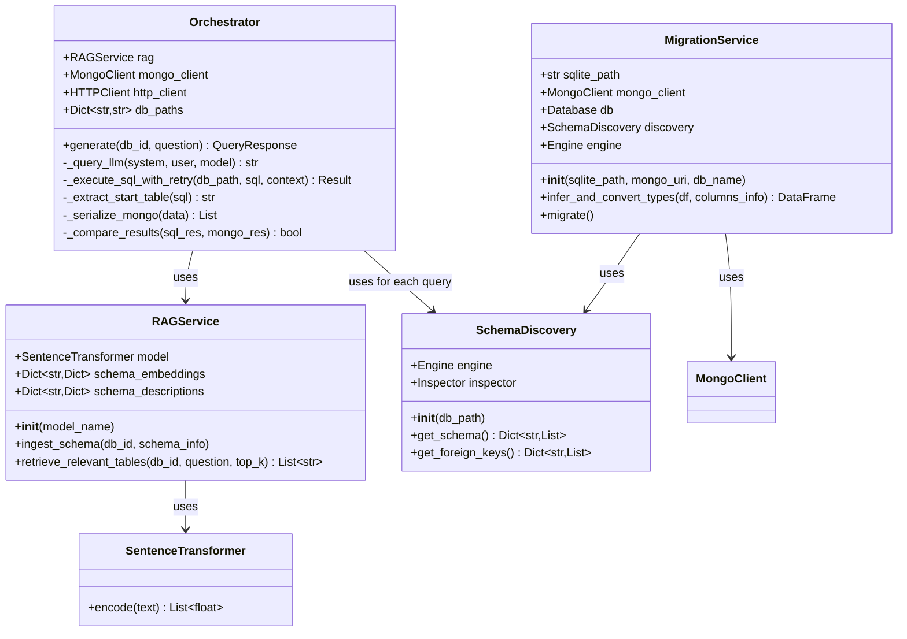

# Low-Level Design (LLD)

## Class Diagram

The core logic resides in the Backend service. The following class diagram details the responsibilities and relationships of the primary Python classes.



---

## Data Models (Schemas)

### QueryRequest
Defined in `backend/app/schemas.py`.
| Field | Type | Validation | Description |
| :--- | :--- | :--- | :--- |
| `question` | `str` | min_length=3 | The natural language question from the user. |
| `db_id` | `str` | required | The identifier of the database to query (e.g., "california_schools", "financial"). |

### QueryResponse
Defined in `backend/app/schemas.py`.
| Field | Type | Description |
| :--- | :--- | :--- |
| `sql_query` | `str` | The generated SQL query. |
| `mongo_pipeline` | `List[Dict[str, Any]]` | The generated MongoDB aggregation pipeline. |
| `sql_result` | `List[Dict[str, Any]]` | The data returned by executing the SQL query. |
| `mongo_result` | `List[Dict[str, Any]]` | The data returned by the MongoDB pipeline. |
| `execution_match` | `bool` | True if `sql_result` and `mongo_result` are equivalent (order-independent set comparison). |
| `explanation` | `Optional[str]` | Optional explanation or summary of the query. |
| `error` | `Optional[str]` | Error message if any step failed. |

---

## Algorithm Logic

### 1. Schema Linking (RAG)

**Objective**: Reduce context window size by identifying only relevant tables for a given question.

**Process**:
1. **Ingestion** (one-time per database):
   - `SchemaDiscovery` reads SQLite metadata using SQLAlchemy Inspector
   - For each table, create textual representation: `"Table: {table_name}. Columns: {col1}, {col2}, ..."`
   - `RAGService.ingest_schema()` generates embeddings using `SentenceTransformer.encode()`
   - Store embeddings in memory cache: `{db_id: {table_name: embedding_vector}}`

2. **Retrieval** (per query):
   - Encode user question into vector: `q_emb = model.encode(question)`
   - Compute cosine similarity between `q_emb` and each table embedding:
     ```python
     score = dot(q_emb, table_emb) / (norm(q_emb) * norm(table_emb))
     ```
   - Sort tables by score (descending)
   - Return top-k tables (default k=5)

3. **Context Pruning**:
   - Only include relevant table schemas in LLM system prompt
   - Reduces token usage from ~thousands to ~hundreds

**Implementation**: `services/inference/rag_service.py` (70 lines)

---

### 2. SQL Generation

**Input**:
- Filtered JSON Schema (only top-k relevant tables)
- User question
- System prompt enforcing SQL syntax rules

**Model**: Base `Qwen/Qwen2.5-Coder-3B-Instruct-GPTQ-Int4`

**Prompt Template**:
```
System: You are an expert SQL developer. Generate ONLY valid SQLite queries.
Schema: {filtered_schema_json}
Question: {user_question}
Output: Return ONLY the SQL query without explanation.
```

**Response Parsing**:
- Extract SQL from LLM response (may contain markdown code blocks)
- Validate basic syntax (presence of SELECT, FROM keywords)

**Implementation**: `Orchestrator._query_llm()` method

---

### 3. Reflexion Loop (Error Handling)

**Current Implementation** (Simplified):
```python
def _execute_sql_with_retry(db_path, sql, schema_context):
    try:
        engine = create_engine(f"sqlite:///{db_path}")
        result = engine.execute(text(sql))
        return result.fetchall()
    except Exception as e:
        # Log error
        print(f"SQL Error: {e}")
        # Future: Feed error back to LLM for regeneration
        raise
```

**Future Enhancement**:
- On SQL execution error, construct feedback prompt:
  ```
  The SQL query failed with error: {error_message}
  Original query: {sql}
  Please fix the query.
  ```
- Retry up to 3 times with corrected queries

**Implementation**: `Orchestrator._execute_sql_with_retry()` (10 lines)

---

### 4. NoSQL Transpilation (SQL → MQL)

**Input**:
- Valid SQL query (verified through successful execution)
- Original schema context

**Model**: LoRA adapter `mql-adapter` (finetuned on SQL-to-MQL pairs)

**Prompt Template**:
```
System: You are an expert at converting SQL to MongoDB Aggregation Pipelines.
Input SQL: {sql_query}
Schema: {schema_json}
Output: Return ONLY a valid JSON array representing the MongoDB pipeline.
```

**Model Selection**:
```python
response = await _query_llm(
    system_prompt=transpilation_prompt,
    user_prompt=sql_query,
    model="mql-adapter"  # Uses LoRA adapter
)
```

**Response Parsing**:
- Extract JSON array from LLM response
- Parse into Python list of dictionaries
- Validate pipeline stage operators (`$match`, `$group`, `$project`, etc.)

**Implementation**: `Orchestrator.generate()` method, lines ~120-140

---

### 5. Result Comparison

**Objective**: Verify that SQL and MongoDB queries return equivalent results.

**Challenge**: 
- Different type representations (e.g., SQL INTEGER vs MongoDB int64)
- Different ordering (SQL may have implicit ORDER BY, MongoDB array order)
- Floating point precision differences

**Strategy**:
```python
def _compare_results(sql_res, mongo_res):
    # 1. Normalize types
    def normalize_item(item):
        normalized = {}
        for k, v in item.items():
            if isinstance(v, datetime):
                normalized[k] = v.isoformat()
            elif isinstance(v, float):
                normalized[k] = round(v, 6)  # Fixed precision
            elif v is None:
                normalized[k] = None
            else:
                normalized[k] = str(v)
        return normalized
    
    # 2. Convert to sets of frozensets (order-independent)
    sql_set = {frozenset(normalize_item(row).items()) for row in sql_res}
    mongo_set = {frozenset(normalize_item(row).items()) for row in mongo_res}
    
    # 3. Compare sets
    return sql_set == mongo_set
```

**Implementation**: `Orchestrator._compare_results()` (48 lines)

---

## Key Methods

### Orchestrator.generate()
**Signature**: `async def generate(self, db_id: str, question: str) -> QueryResponse`

**Flow**:
1. Locate database file: `db_path = self.db_paths.get(db_id)`
2. Schema discovery: `discovery = SchemaDiscovery(db_path)`
3. Ingest schema into RAG: `self.rag.ingest_schema(db_id, schema)`
4. Retrieve relevant tables: `tables = self.rag.retrieve_relevant_tables(db_id, question, top_k=5)`
5. Generate SQL: `sql = await self._query_llm(system_prompt, question, model="base")`
6. Execute SQL: `sql_result = self._execute_sql_with_retry(db_path, sql, schema)`
7. Transpile to MQL: `mql = await self._query_llm(transpile_prompt, sql, model="mql-adapter")`
8. Extract start table: `collection = self._extract_start_table(sql)`
9. Execute MQL: `mongo_result = self.mongo_client[db_id][collection].aggregate(mql)`
10. Compare results: `match = self._compare_results(sql_result, mongo_result)`
11. Return response

**Length**: 139 lines (main orchestration logic)

### RAGService.retrieve_relevant_tables()
**Signature**: `def retrieve_relevant_tables(self, db_id: str, question: str, top_k: int = 5) -> List[str]`

**Flow**:
1. Check if schema is ingested: `if db_id not in self.schema_embeddings: return []`
2. Encode question: `q_emb = self.model.encode(question)`
3. Compute similarity scores for all tables
4. Sort by score descending
5. Return top-k table names

**Length**: 19 lines

### MigrationService.migrate()
**Signature**: `def migrate(self) -> None`

**Flow**:
1. Get schema and foreign keys: `schema = self.discovery.get_schema()`
2. For each table:
   - Clear existing MongoDB collection: `self.db[table].delete_many({})`
   - Read SQLite table in 50,000-record chunks: `pd.read_sql_table(..., chunksize=50000)`
   - Convert types: `chunk = self.infer_and_convert_types(chunk, columns)`
   - Handle datetime NaT: `chunk[col] = chunk[col].astype(str).replace('NaT', None)`
   - Insert to MongoDB: `self.db[table].insert_many(records)`
3. Create indexes based on foreign keys

**Length**: 58 lines (main migration loop)

---

## File Locations

| Component | File Path | Lines | Purpose |
|:---|:---|:---:|:---|
| Orchestrator | `backend/app/services/orchestrator.py` | 283 | Main query orchestration |
| RAG Service | `services/inference/rag_service.py` | 70 | Schema linking via embeddings |
| Schema Discovery | `services/migration/schema_discovery.py` | 50 | SQLite metadata extraction |
| Migration Service | `services/migration/migrate.py` | 121 | SQLite → MongoDB data transfer |
| API Schemas | `backend/app/schemas.py` | 24 | Pydantic request/response models |
| FastAPI Entry | `backend/app/main.py` | 19 | REST API endpoints |
| Streamlit UI | `frontend/app.py` | 131 | Web interface |
