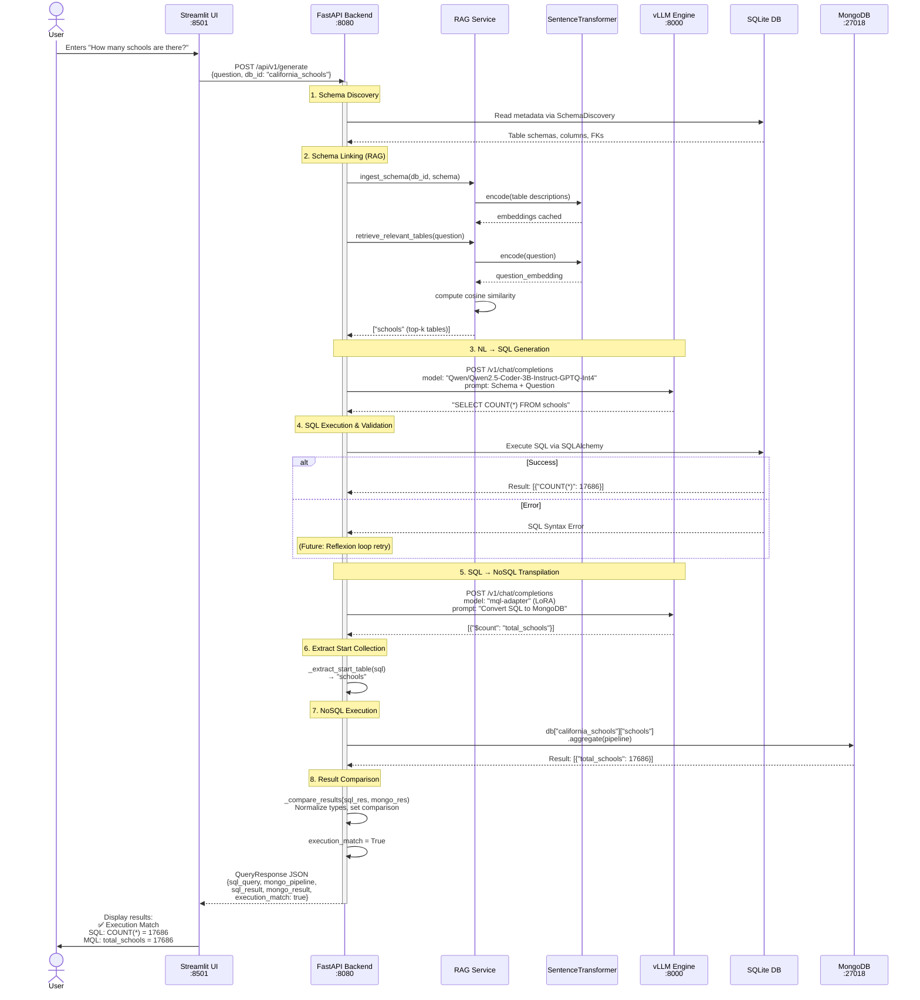
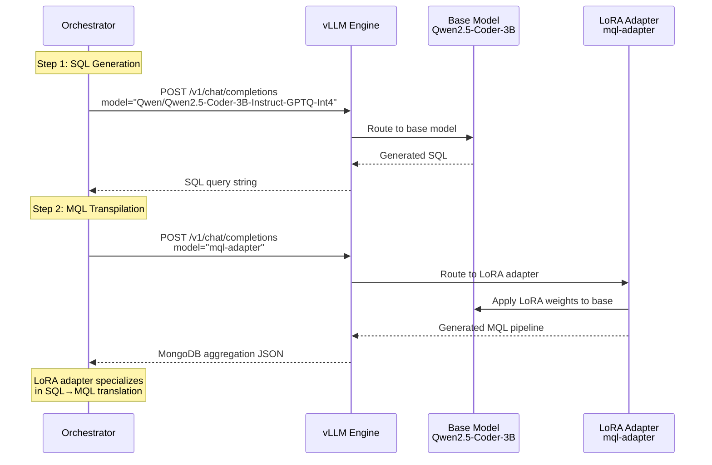
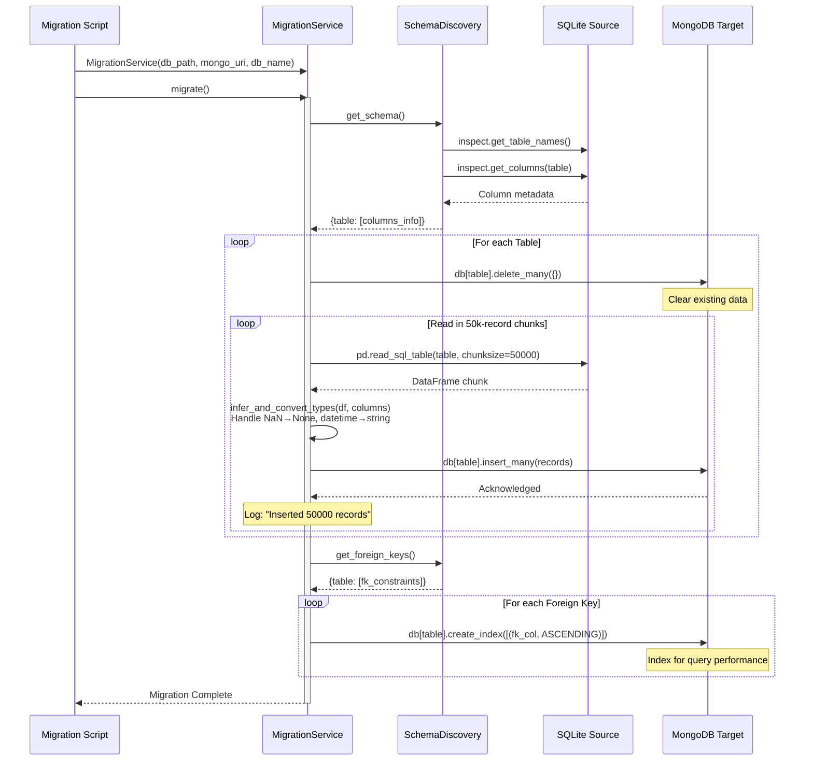
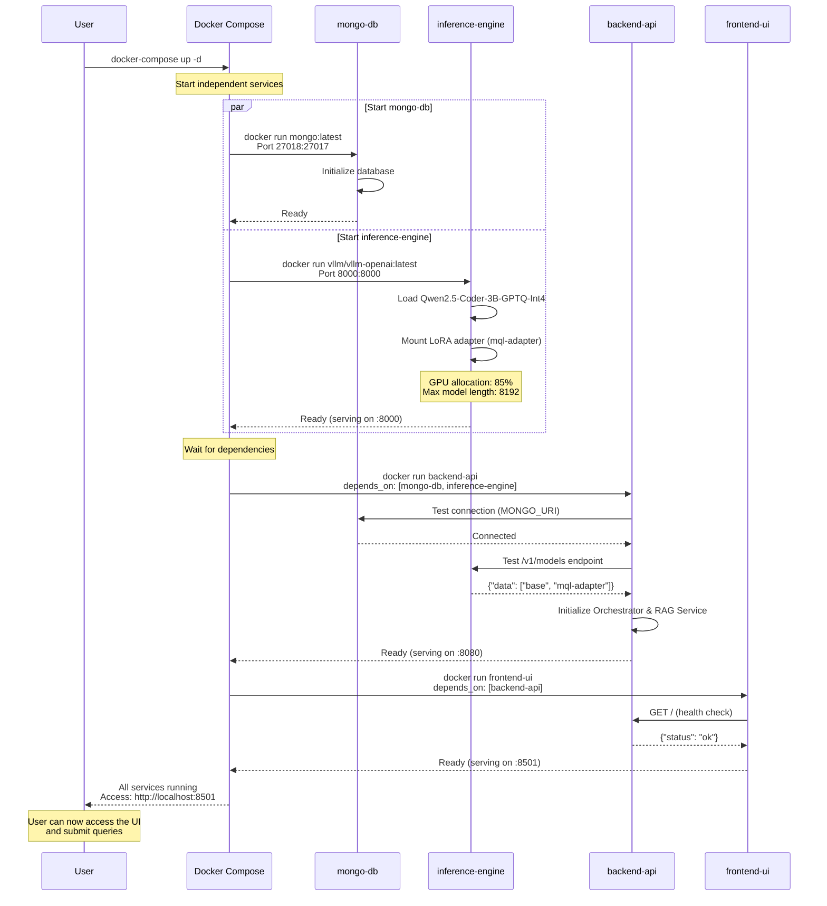
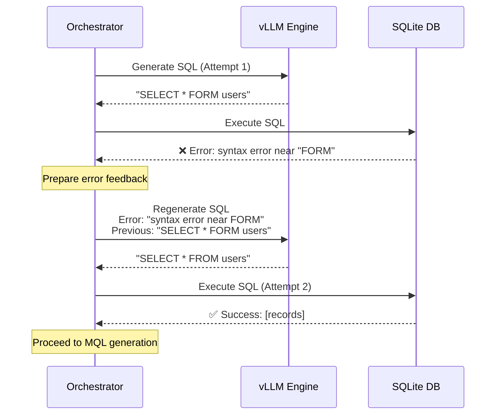

# Sequence Diagrams

## 1. End-to-End Query Execution
This diagram depicts the flow when a user asks a question via the UI.

---

## 2. Model Selection Flow (LoRA Adapter)

This diagram shows how the orchestrator selects between the base model and LoRA adapter.

---

## 3. Data Migration Process
This diagram shows how data is moved from the source SQLite to the target MongoDB.

---

## 4. Docker Compose Startup Sequence

This diagram shows the service initialization order and dependencies.

---

## 5. Error Handling and Reflexion (Future Enhancement)

**Note**: Current implementation has basic error catching but no automatic retry loop. Future versions will implement full reflexion as shown above.
